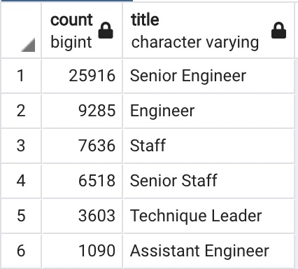
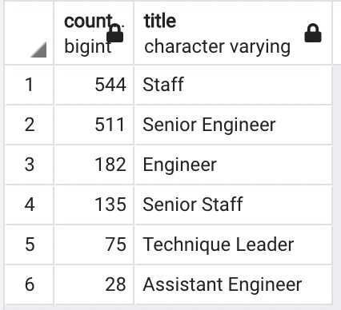

# Overview
In this analysis, we are helping the manager of a company to prepare for a large amount of current employees to approach retirement age. We determine the number of retiring employees per title and identify employees eligible for the mentorship program.

# Resources
Data source: departments.csv, dept_emp.csv, dept_manager.csv, employees.csv, salaries.csv, titles.csv

Software: PostgreSQL 11, pgAdmin 4 Version 6.4

# Results
### Four major points from Deliverables 1 & 2
- 54,048 employees will be retiring.
- Two-thirds of retirees are engineers
- Over half of retirees are senior engineers.
- 1,475 employees are eligible for mentorship.

# Summary
- 54,048 roles will need to be filled as the flux of retirees begin to make an impact. 
- This additional query will help us calculate the ratio of retirees to current employees in the Development department in order to highlight the urgency to fill these roles.

`SELECT COUNT(emp_no)
FROM dept_emp
WHERE dept_no = ('d005');`

- This query shows the current employee count for the Development department of 78,713. With 36,291 engineers retiring soon, this department will be losing almost half of their staff.

- There are not enough qualified, retirement-ready employees in the departments to mentor the next generation of employees. Only 1,475 employees eligible for mentorship.
- This additional table shows the breakdown of these employees by title. We can compare this to the table of soon-to-be vacancies above.

